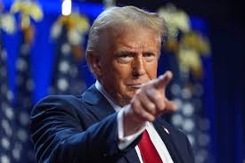
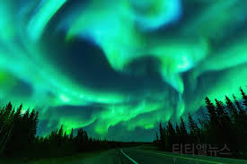

# Ollama
Describe Images using Ollama Models 

### Step 1. run docker
```bash 
$ docker run -p 11434:11434 --name ollama-dev [Docker Image]
$ docker exec -it ollama-dev /bin/bash
```

### Step 2. Set env 
Inside the container, set the Ollama API host so the model can connect properly.
```bash
$ export OLLAMA_HOST=http://host.docker.internal:11434
```

### Step 3. Ollama Connection test
Before running image descriptions, test if Ollama is running correctly.
```bash
$ apt-get update -y
$ apt-get install curl -y
$ curl http://host.docker.internal:11434/api/tags
```
### Step 4. run Ollama models 
Now, we can use a Python script to generate descriptions.
``` bash
$ python describe_image.py --file_name 01.jpg
```

### llama3.2-vision model results


The image depicts Donald Trump, former President of the United States, standing in front of an American flag. He is dressed in a dark blue suit jacket and red tie, with his right hand extended forward as if he is pointing at something or someone.
In the foreground, Trump's facial expression is blurred, but his posture suggests that he may be addressing an audience or speaking to someone directly. The background of the image features a blurry American flag hanging from a stand, adding context to the scene. Overall, the image captures a moment of Trump in action, possibly during a public appearance or speech.

이 이미지는 도널드 트럼프 전 미국 대통령이 미국 국기 앞에 서 있는 모습을 담고 있습니다. 그는 짙은 파란색 정장 재킷과 빨간색 넥타이를 착용하고 있으며, 오른손을 앞으로 뻗어 무언가를 가리키는 듯한 자세를 취하고 있습니다. 트럼프의 얼굴 표정은 흐릿하게 보이지만, 그의 자세로 보아 청중에게 연설하거나 누군가와 직접 대화하고 있는 것으로 추측됩니다. 배경에는 흐릿하게 보이는 미국 국기가 걸려 있어 장면에 맥락을 더해줍니다. 이 이미지는 트럼프가 공적인 자리에서 활동하는 순간을 포착한 것으로 보입니다.




