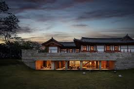
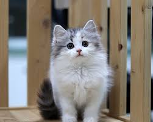
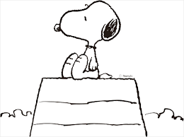

# Ollama
Describe Images using Ollama Models 

### Step 1. run docker
```bash 
$ docker run -p 11434:11434 --name ollama-dev [Docker Image]
$ docker exec -it ollama-dev /bin/bash
```

### Step 2. Set env 
Inside the container, set the Ollama API host so the model can connect properly.
```bash
$ export OLLAMA_HOST=http://host.docker.internal:11434
```

### Step 3. Ollama Connection test
Before running image descriptions, test if Ollama is running correctly.
```bash
$ apt-get update -y
$ apt-get install curl -y
$ curl http://host.docker.internal:11434/api/tags
```
### Step 4. run Ollama models 
Now, we can use a Python script to generate descriptions.
``` bash
$ python describe_image.py --file_name 01.jpg
```


## llama3.2-vision model results


The image depicts Donald Trump, former President of the United States, standing in front of an American flag. He is dressed in a dark blue suit jacket and red tie, with his right hand extended forward as if he is pointing at something or someone.
In the foreground, Trump's facial expression is blurred, but his posture suggests that he may be addressing an audience or speaking to someone directly. The background of the image features a blurry American flag hanging from a stand, adding context to the scene. Overall, the image captures a moment of Trump in action, possibly during a public appearance or speech.

이 이미지는 도널드 트럼프 전 미국 대통령이 미국 국기 앞에 서 있는 모습을 담고 있습니다. 그는 짙은 파란색 정장 재킷과 빨간색 넥타이를 착용하고 있으며, 오른손을 앞으로 뻗어 무언가를 가리키는 듯한 자세를 취하고 있습니다. 트럼프의 얼굴 표정은 흐릿하게 보이지만, 그의 자세로 보아 청중에게 연설하거나 누군가와 직접 대화하고 있는 것으로 추측됩니다. 배경에는 흐릿하게 보이는 미국 국기가 걸려 있어 장면에 맥락을 더해줍니다. 이 이미지는 트럼프가 공적인 자리에서 활동하는 순간을 포착한 것으로 보입니다.
----------------



This photograph captures a serene scene of a house situated on a lush grassy lawn, bathed in warm light emanating from its interior.
The two-story residence features an Asian-inspired design with white trim and a dark roof. The first floor boasts large windows along its front side, while the second story is partially obscured by trees to the left. The building's façade appears to be constructed from stone or concrete blocks.
In the foreground, the grassy lawn stretches out, punctuated by two small objects that are too blurry to discern. The background reveals a dramatic sky with dark clouds and a hint of pink on the horizon, evoking the atmosphere of either sunrise or sunset.

이 사진은 아시아풍 디자인의 2층 주택이 따뜻한 내부 조명으로 빛나는 모습을 담고 있습니다. 집은 하얀 테두리와 어두운 지붕을 가지고 있으며, 1층 전면에는 큰 창문들이 자리하고 있습니다. 2층은 왼쪽의 나무들에 의해 부분적으로 가려져 있습니다. 건물의 외관은 돌이나 콘크리트 블록으로 지어진 것처럼 보입니다. 전경에는 푸른 잔디밭이 펼쳐져 있으며, 두 개의 작은 물체가 흐릿하게 보입니다. 배경에는 어두운 구름과 함께 수평선에 분홍빛이 감도는 하늘이 드리워져 있어, 일출이나 일몰의 분위기를 자아냅니다.
-------------------------------------------------


This photograph features a small, long-haired white kitten with striking grey stripes on its back and tail. The kitten's large eyes are round and black, while its ears are perked up, accentuating its alert demeanor. Its pink nose is slightly upturned, giving it an endearing expression.
The kitten stands upright on two legs, resting its weight on a wooden surface that appears to be the top of a fence or gate, likely made of untreated wood such as cedar or pine. The blurred background suggests a natural setting, possibly outdoors in a garden or yard, with grass and other vegetation visible beyond the wooden structure.

이 사진에는 긴 털을 가진 작은 흰색 새끼 고양이가 등장합니다. 고양이의 등과 꼬리에는 눈에 띄는 회색 줄무늬가 있으며, 큰 눈은 둥글고 검은색입니다. 귀는 쫑긋 서 있어 경계심 많은 모습을 강조하고, 살짝 들린 분홍색 코는 사랑스러운 표정을 더해줍니다.
새끼 고양이는 두 발로 서서 나무 표면에 몸을 기대고 있는데, 이 나무는 아마도 삼나무나 소나무 같은 가공되지 않은 목재로 만든 울타리나 문 위쪽일 것입니다. 배경은 흐릿하게 처리되어 자연 환경, 아마도 정원이나 마당일 가능성이 있으며, 나무 구조물 너머로 풀과 다른 식물이 보입니다.
전체적으로 이 이미지는 자연 환경에서의 장난스럽고 호기심 많은 새끼 고양이의 민첩함과 적응력을 잘 보여줍니다.


The image depicts a serene and mystical scene, with the aurora borealis dancing across the sky in shades of green. The purpose of this image is to showcase the natural beauty of the Northern Lights.
* A road:
        + The road stretches out into the distance, curving slightly as it disappears from view.
        + It appears to be a rural or wilderness area, with no signs of human activity nearby.
        + The road is empty and quiet, with no cars or pedestrians in sight.
* Trees:
        + Tall trees line both sides of the road, their branches stretching up towards the sky like outstretched arms.
        + The trees are dark green and appear to be evergreen, with a few bare branches visible among the foliage.
        + They provide a sense of depth and scale to the image, creating a feeling of vastness and isolation.
* Aurora Borealis:
        + The aurora borealis is depicted as a swirling, ethereal display of light and color in the sky above the trees.
        + It appears to be moving rapidly, with streaks of green and blue radiating outward from a central point.
        + The colors are vibrant and vivid, casting an otherworldly glow over the entire scene.
Overall, the image presents a breathtaking and enchanting view of the natural world, with the aurora borealis adding an extra layer of magic and wonder to the already picturesque landscape.

이 이미지는 고요하고 신비로운 장면을 담고 있으며, 하늘을 가로지르는 오로라가 녹색의 빛으로 춤추고 있습니다. 이 이미지는 북극광의 자연미를 보여주기 위한 것입니다. 도로는 멀리까지 이어지며, 약간의 곡선을 그리며 시야에서 사라집니다. 주변에는 인간의 흔적이 없는 시골이나 자연 지역으로 보이며, 도로는 차나 보행자 없이 조용하고 고요합니다. 도로 양쪽에는 키 큰 나무들이 줄지어 서 있으며, 그 가지들은 하늘을 향해 팔을 뻗은 듯한 모습입니다. 나무들은 짙은 녹색의 상록수로 보이며, 몇몇 가지는 잎이 없는 모습도 보입니다. 이 나무들은 이미지에 깊이와 규모감을 더해주며, 광활하고 고립된 느낌을 줍니다. 오로라는 나무 위 하늘에서 소용돌이치는 신비로운 빛과 색의 장관으로 묘사되며, 중앙에서부터 녹색과 파란색의 줄기가 빠르게 퍼져나가는 모습입니다. 색상은 생생하고 선명하여, 전체 장면에 다른 세상의 빛을 더해줍니다. 전체적으로 이 이미지는 자연 세계의 숨막히고 매혹적인 모습을 보여주며, 오로라가 이미 그림 같은 풍경에 마법과 경이로움을 더해줍니다.



This image features a whimsical black and white drawing of Snoopy, the beloved Peanuts character, sitting atop his doghouse.
Snoopy is depicted in profile, facing left, with his head tilted slightly upwards and his nose pointed towards the sky. He appears to be gazing at something beyond the horizon. The doghouse itself is partially visible, showcasing three horizontal lines that suggest the presence of a roof or top surface.
The image has a minimalistic quality, with a simple black outline drawing on a white background, devoid of any additional details or colors. This style adds to the character's endearing and innocent charm, making it an appealing representation of Snoopy in his iconic doghouse setting.

이 이미지는 사랑받는 피너츠 캐릭터 스누피가 그의 개집 위에 앉아 있는 흑백의 유쾌한 그림을 담고 있습니다. 스누피는 왼쪽을 바라보며 옆모습으로 그려져 있으며, 머리를 약간 위로 기울이고 코를 하늘 쪽으로 향하고 있습니다. 그는 수평선 너머를 응시하는 듯한 모습입니다. 개집은 부분적으로 보이며, 지붕이나 상단 표면을 암시하는 세 개의 수평선이 그려져 있습니다. 이 이미지는 흰색 배경에 단순한 검은 윤곽선으로 그려져 있어, 추가적인 세부사항이나 색상이 없습니다. 이러한 스타일은 스누피의 사랑스럽고 순수한 매력을 더해주며, 그의 상징적인 개집 장면을 매력적으로 표현하고 있습니다.
